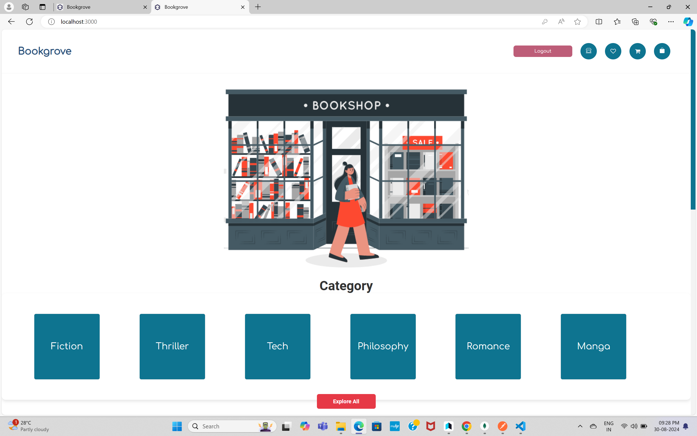
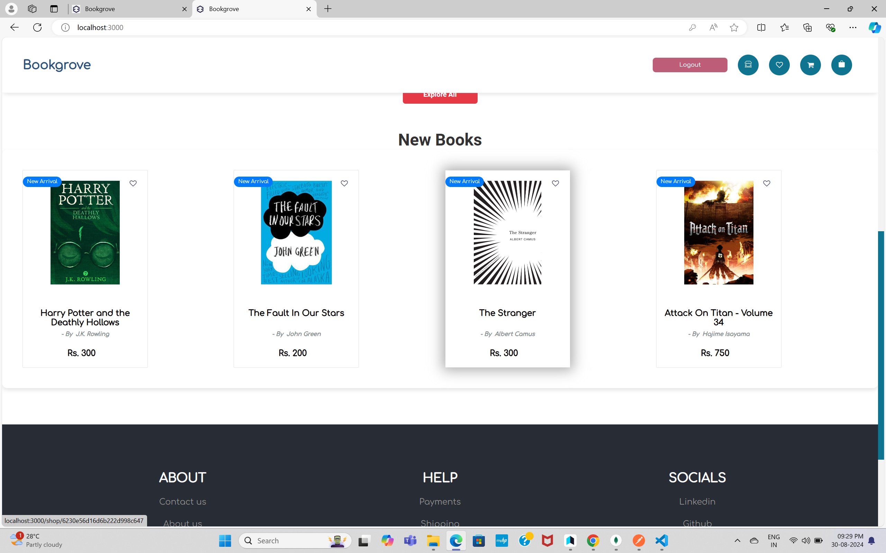
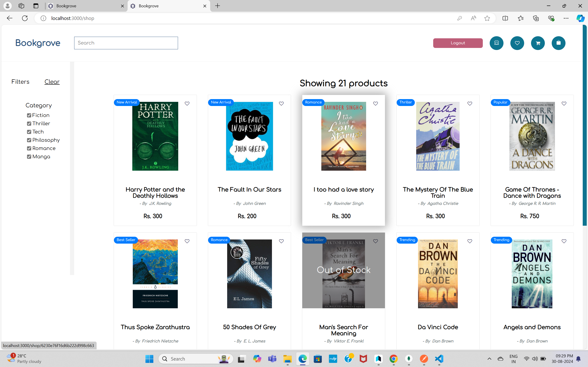
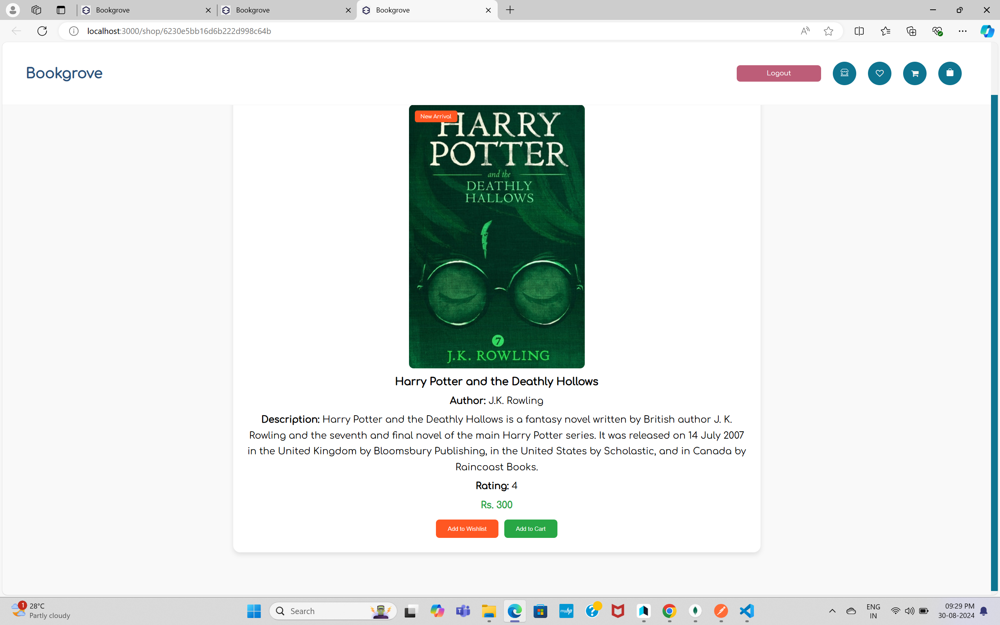
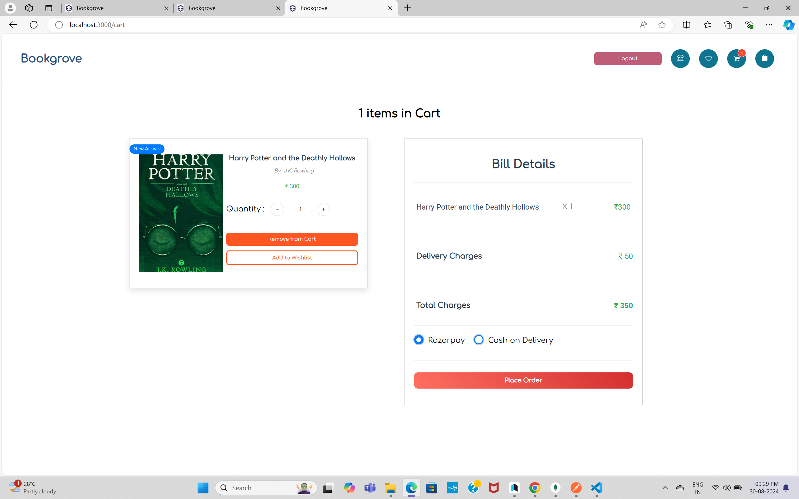
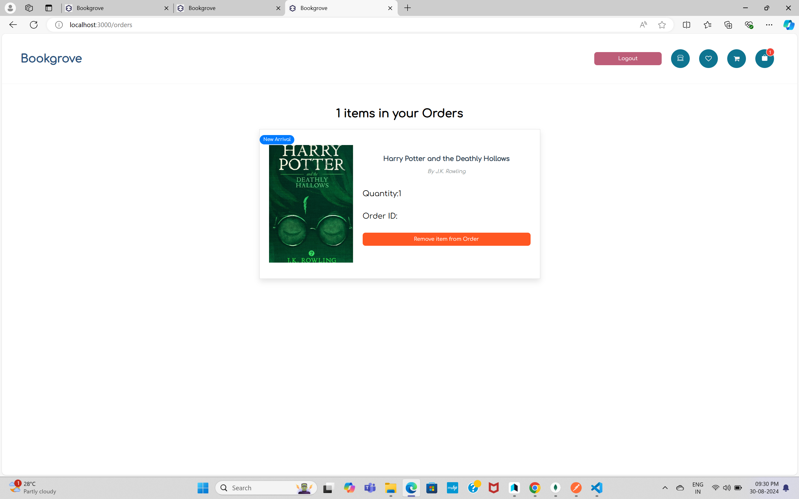

# Full Stack E-Commerce Project using MERN

## Available Scripts

In the project directory, you can run:

### `npm start`

Runs the app in the development mode.\
Open [http://localhost:3000](http://localhost:3000) to view it in your browser.

The page will reload when you make changes.\
You may also see any lint errors in the console.

## Technologies Used

1. HTML
2. CSS
3. JavaScript
4. React
5. Node.js
6. Express.js
7. MongoDB

## Features

1. User Authentication (Signup, Login, and Logout)
2. Landing Page with Categories and New Arrivals
3. Product Listing Page
4. Sorting and Filtering Products:
   - Filter by Categories
   - Clear All Filters

5. Cart Management:
   - Add to Cart
   - Change Item Quantity in Cart
   - Remove from Cart
6. Single Product Page
7. Order Summary of Ordered Items
8. Custom Toast Component with 4 Types: Success, Error, Warning, and Information
9. Orders Page
10. Search Bar to Search Books by Book Name and Author
11. Pagination

## Screenshots

### Home Page

### Product Listing Page

### User Authentication Pages

### Single Product Page

### Cart Page

### Orders Page

